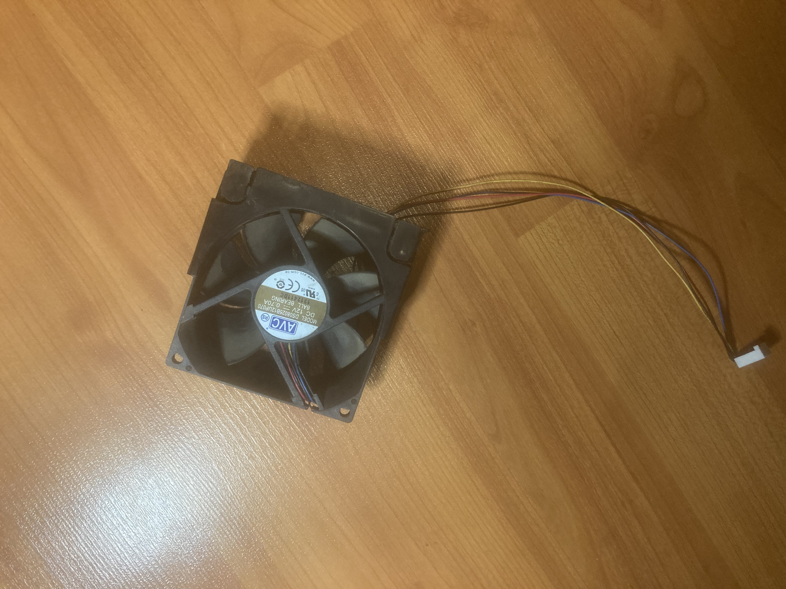
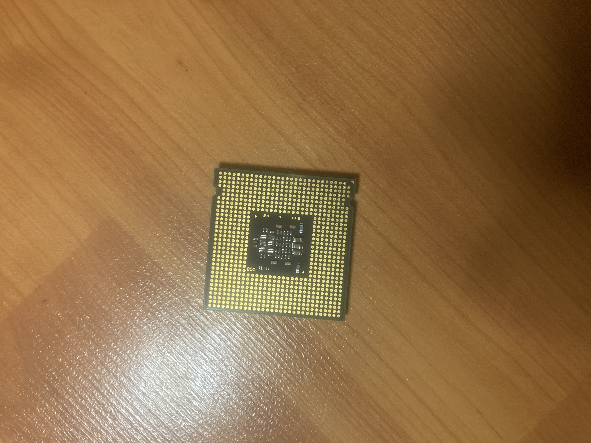
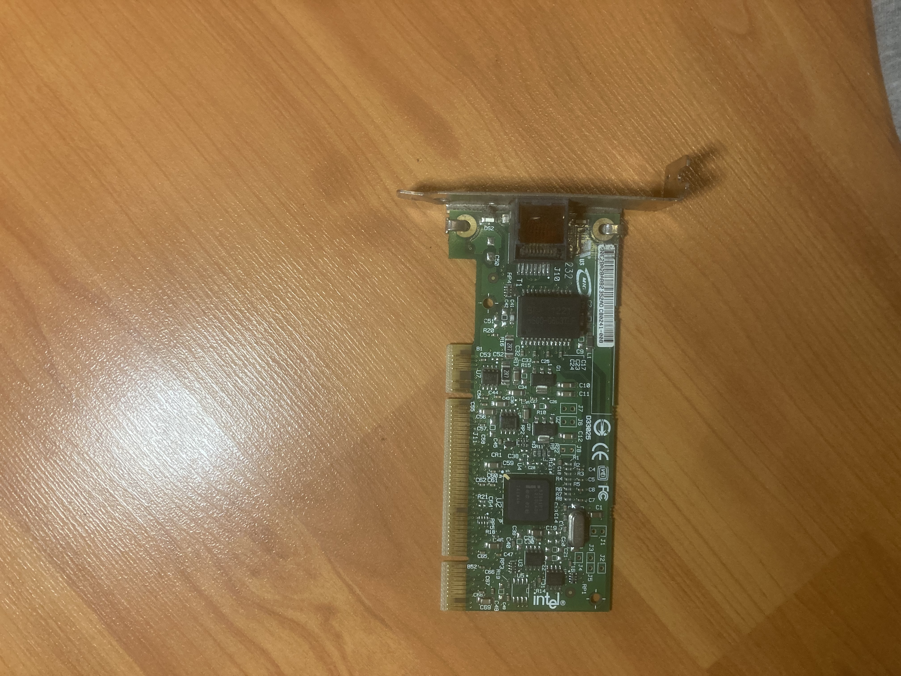
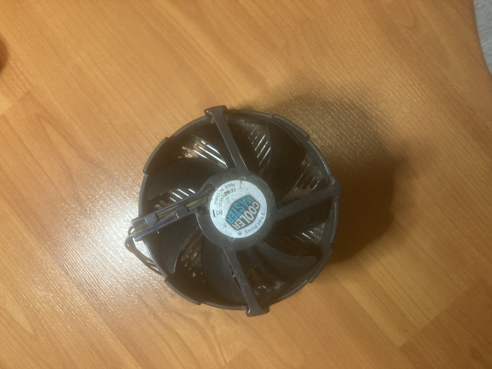
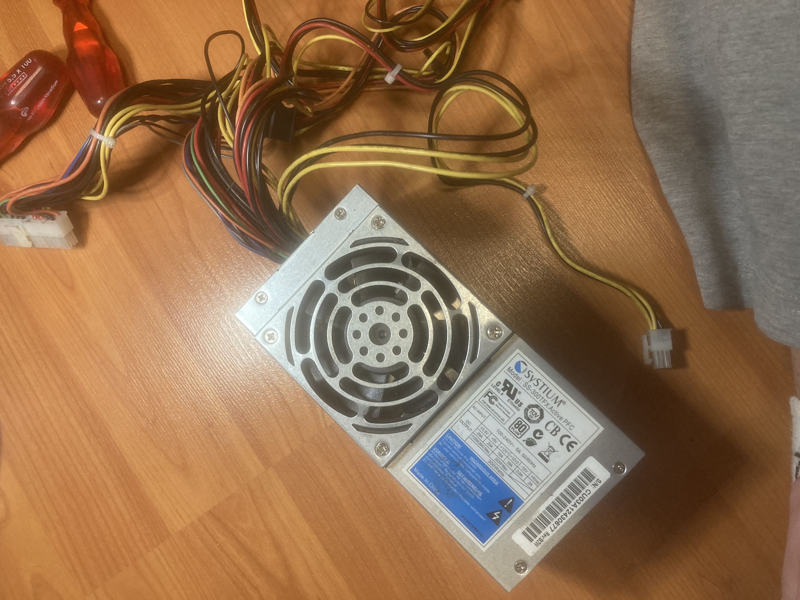
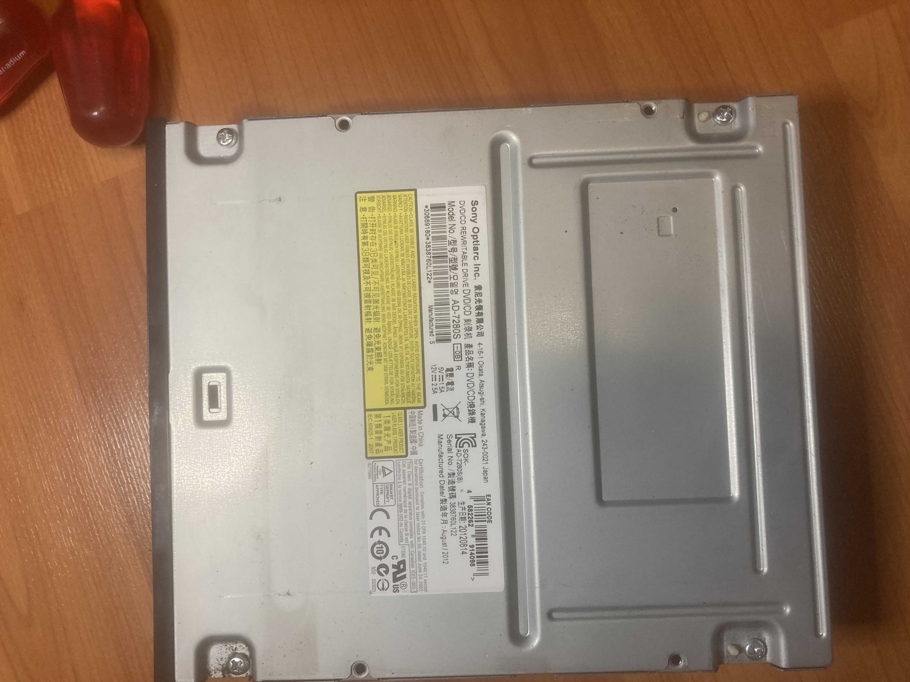
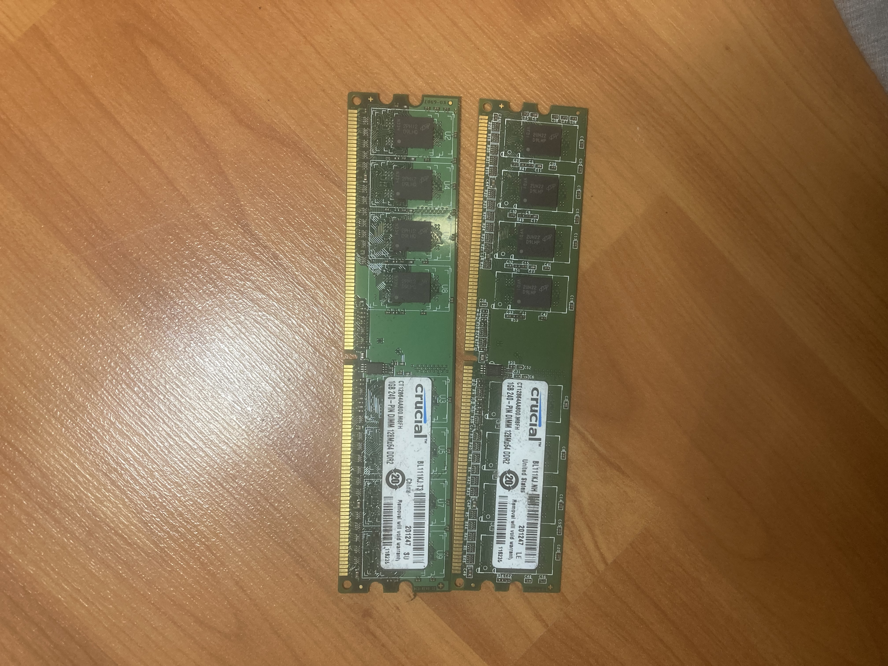
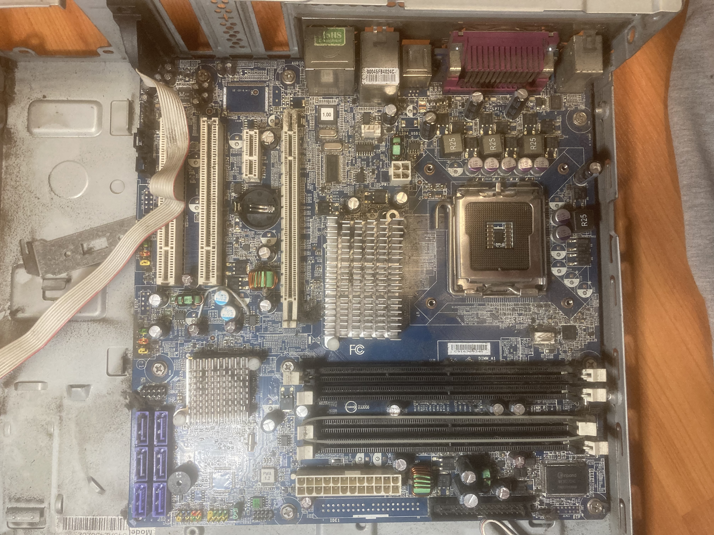

# Flegl-projekt-pocitac-2
## Cíl
Cílem projektu je provést kompletní, bezpečné a zdokumentované rozebrání dvou stolních počítačů a následně porovnat jejich součástky. Projekt slouží jako praktická příručka pro pochopení vnitřní struktury PC, fungování jednotlivých komponentů

## Zadání
Mým úkolem bylo vybrat si projekt, který souvisí s mým oborem a zároveň mi umožní něco si prakticky vyzkoušet.

### Tým 
Pracoval jsem na tom částečně sám s pomocí táty.

### Proč jsem si to vybral
Zvolil jsem si toto téma, protože jsem chtěl zjistit, jaký počítač měl můj děda, jaké komponenty obsahoval a v jakém je stavu. Zároveň jsem chtěl, aby táta věděl, jak počítač funguje a co se v něm nachází.

## PŘÍPRAVA
Příprava byla poměrně jednoduchá.

#### Potřeboval jsem:

křížový šroubovák,

dobré osvětlení,

oba počítače, které jsem chtěl rozebírat.

Protože mám doma nastavitelné světlo, nastavil jsem 5000 K, aby bylo neutrální a dobře se mi pracovalo. Při přípravě jsem si také přečetl pár rad a postupů, ve kterých mi pomohla také AI.

## DEMONTÁŽ
### 1)krok 
Nejprve jsem u obou počítačů sundal boční kryt.
Použil jsem křížový šroubovák a při některých šroubcích bylo potřeba použít i trochu síly, protože byly staré a utažené více, než je dnes běžné.

### 2)krok
#### První vizuální kontrola

Zkontroloval jsem množství prachu.

Ověřil jsem, zda nejsou kabely poškozené.

### 3)krok Odpojení kabeláže
Ujistíme se, že jste odpojili napájecí kabely (včetně těch vedoucích k disku a optické mechanice) a datové kabely (SATA).
### 4)krok
#### Vyjmutí úložiště a optické mechaniky
V tomto kroku jsem se zaměřil na demontáž mechanik a disků.
Optická mechanika: Vyjmul jsem DVD±RW vypalovačku Sony Optiarc (model AD-7280S). Tato mechanika využívá pro přenos dat i napájení rozhraní SATA.
Pevný disk: Demontoval jsem úložiště, které v tomto případě sloužilo pro data a operační systém (na fotkách je vidět uvolněná SATA kabeláž vedoucí k pozicím disků).

### 5)krok
#### Vyjmutí Ram
Následovalo vyjmutí operační paměti ze slotů na základní desce.
Vyjmul jsem dva paměťové moduly značky Crucial.
Jedná se o moduly Ballistix (1GB 240-PIN DIMM), které odpovídají standardu DDR2.
Paměti byly osazeny v černých slotech pro zajištění dvoukanálového zapojení (Dual Channel).

### 6)krok
#### Vyjmutí Karet a Zdroje
Dále jsem pokračoval v odstraňování rozšiřujících karet a napájecího bloku.
Nejdříve jsem odšrouboval a vyjmul přídavnou síťovou kartu Intel, která byla osazena v bílém slotu PCI. Tato karta poskytuje další RJ-45 konektor pro připojení k síti.
Následně jsem demontoval napájecí zdroj. Jedná se o model Systium SS-300TFX. Na rozdíl od běžných zdrojů má tento úzký profil (formát TFX) a výkon 300W.

### 7)krok
#### Vyjmutí základní desky
Posledním krokem hlavní demontáže bylo uvolnění samotného "srdce" počítače.
Základní deska: Po odpojení všech zbývajících kabelů jsem vyšrouboval modrou základní desku z šasi. Deska disponuje paticí LGA 775 a čipovou sadou Intel.
Chlazení: Z procesoru byl sejmut masivní kulatý chladič značky Cooler Master.
Procesor (CPU): Po odjištění patice jsem vyjmul procesor. Zespodu jsou vidět kontaktní plošky (piny jsou součástí patice na desce), což potvrzuje platformu Intel LGA 775.
Ventilátor: Součástí demontáže byl i systémový ventilátor AVC, který byl připojen k základní desce pomocí 4-pinového konektoru pro regulaci otáček.
 
### 8)krok
#### Kompletní rozložení PC
Postup demontáže byl úspěšně dokončen. Na základě pořízených fotografií byly identifikovány následující díly:

Skříň (Case): Kompaktní kancelářské provedení (SFF), které vyžadovalo specifické uspořádání komponent.

Základní panel (I/O Shield): Obsahuje porty pro připojení periferií: PS/2 (klávesnice/myš), VGA (D-Sub), sériový port (COM), USB porty, Ethernet (RJ-45) a audio konektory.

Zdroj (Systium SS-300TFX): Jedná se o napájecí zdroj formátu TFX s výkonem 300W (Active PFC). Převádí střídavý proud ze zásuvky na stejnosměrný proud potřebný pro komponenty.

Základní deska (Intel): Modrá deska s paticí LGA 775. Obsahuje 4 sloty pro RAM, 4 SATA porty a jeden rozšiřující slot PCI Express.

CPU (Procesor): Model pro patici Intel LGA 775 (piny jsou umístěny přímo v patici na desce). K chlazení byl použit chladič Cooler Master.

RAM (Crucial): Dva moduly Crucial Ballistix (1GB 240-PIN DIMM). Podle typu slotů se jedná o paměti typu DDR2.

Optická mechanika (Sony Optiarc): DVD vypalovačka, model AD-7280S, s rozhraním SATA.

Síťová karta (Intel): Přídavná karta do slotu PCI, která doplňuje integrovanou síťovou kartu na desce.

Ventilátor (AVC): Přídavný systémový ventilátor (model DS08025B12U) zajišťující cirkulaci vzduchu ve skříni.

  
  
  
  
  
  
  
  

## Porovnání komponent: První počítač vs. Druhý počítač

### Tabulkové srovnání

| Komponent | První počítač (Předloha) | Druhý počítač (Realita) | Verdikt |
| :--- | :--- | :--- | :--- |
| **Základní deska** | **ASUS P5QL-E** | **Intel (modrá)** | **První počítač** nabízí více rozšiřujících slotů. |
| **Operační paměť** | **Kingston ValueRAM** | **Crucial Ballistix DDR2** | **Druhý počítač** disponuje prémiovou řadou pamětí. |
| **Napájecí zdroj** | **ARENA 355W** | **Systium (Seasonic) 300W** | **Druhý počítač** má kvalitnější zdroj s vyšší efektivitou. |
| **Chlazení CPU** | Standardní chladič | **Cooler Master** | **Druhý počítač** má robustnější chladící systém. |
| **Přídavný ventilátor** | Standardní (AVC) | **AVC (DS08025B12U)** | **Shodné**, oba používají odolný model s kuličkovým ložiskem. |
| **Síťová karta** | **TP-Link PCI** | **Intel PCI** | **Druhý počítač** používá stabilnější síťové řešení Intel. |

### Celkové zhodnocení

**Který počítač je lepší?**

I když má **První počítač** o něco vybavenější základní desku, **Druhý počítač** považuji za celkově lepší díky kvalitě použitých komponent:

* **Spolehlivost:** **Druhý počítač** využívá špičkový napájecí zdroj **Systium** (Seasonic) a profesionální síťovou kartu **Intel**.
* **Výkon RAM:** Paměti **Crucial Ballistix** ve **Druhém počítači** patří do vyšší výkonnostní třídy.
* **Chlazení:** Kombinace chladiče **Cooler Master** a průmyslového ventilátoru **AVC** zajišťuje ve **Druhém počítači** lepší odvod tepla a delší životnost.

**Druhý počítač** je postaven z technicky vyspělejšího hardwaru, který je i přes kompaktnější rozměry skříně odolnější a spolehlivější.

## VIDEA
https://youtu.be/-hNzqul3f-c
### CITACE
Pomoc táty a umělé inteligence google Gemii.

GEMII, Google. Rozhovor s modelem Gemini na téma rozebírání počítačů. Online. Gemini (Google AI). 2025, roč. 2025, č. 12, s. 1. Dostupné z: Gemii, https://gemini.google.com/. [cit. 2025-12-19].

